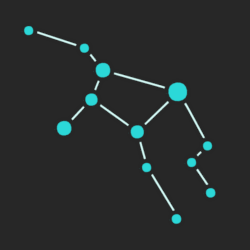

# Astrea Scientific Volume Renderer (Front End)

Astrea is a WebGL based, free and open-source, performant 3D viewer for scientific volumetric data, such as CT, MR or confocal microscopy results.

## Features

### Without back-end

- Upload and interactively display your volume data.
- Correct non-isodiametric voxel information.
- Crop to sub-volume.

### With back-end

- Save your sample.

## Usage

Watch [longer version](https://youtu.be/NAFFz4ExEes)

Please keep in mind, this project is far from completion, it hasn't been tested on a wide variety of browsers and platforms, and still misses many planned features. However, its static (no back-end) version  should be fine to use with a modern Chrome browser on Desktop.

### Usage without back-end

1. Go to this [site](https://attilavm.github.io/astrea-front-end/)
2. Click on the plus sign, upload your slices as an image sequence. They must be uniform in scale. Currently only the image formats which have support from you browser will work, so no `.tif` or `.dicom` yet. I recommend you to use `.png`. For a simple test run I made a [downloadable sample](https://www.dropbox.com/s/ojd8c99v5qli0g2/mr.zip?dl=0), you can find the original `.tif` sequence version at [The Stanford volume data archive](https://graphics.stanford.edu/data/voldata/voldata.html)

## Roadmap

### Write JS unit tests

Until this point I was mostly experimenting, without solid expectations, now I learned enough to form and express explicit expectations as unit tests.

### Rewrite app to handle state, preferably with Elm or Redux

This is a big choice with huge consequences, using Elm would be way better for code clarity and quality, however, it may introduce some performance issues. So I will make some experiments first.

### GLSL code generation and testing

GLSL code is obviously hard to unit test, thankfully I kept it short, but to go further I should find a way to ensure reliability.

So I will research and experiment on this topic.

There are some tools based on Google's glsl-unit, which may be proven useful:

- [glslprep](https://github.com/tschw/glslprep.js)
- [glsl-man](https://github.com/lammas/glsl-man)

### Increase volume resolution

WebGL limits texture size by its highest dimension. So I must generate a grid montage instead of the currently used vertical one.

This will exponentially increase the volume sampling resolution, and most likely make the real-time rendering not so real-time. To counter this I have two choices.

#### mipmapping (preferred)

During camera motion my shader code should operate on a mipmap volume texture, then when it ends render the full-res volume texture. This would be the most elegant approach, and it requires only minor changes.

#### Dynamic ray sampling resolution in the fragment shader.

This would highly increase the fragment shader complexity, and possibly less performant than mipmapping.

### Revisit GLSL code

GLSL code performs fine for a pre-alpha release, even though this is my first experience with GPU programming. However, it has room for improvement.

I should explore the deeper domains of linear algebra and projection geometry to find more powerful ways to implement the volume renderer.

### Rethink GUI

`dat.gui` is nice, but has no ranged sliders. It is not so hard to extend, so if I can make it elegantly interoperate with Elm or Redux, then I'll improve it, otherwise I'll search or write a new GUI module.

### User and asset management

### Annotation capability

### Reproducible sample/view state

### Write user documentation

### First major release
